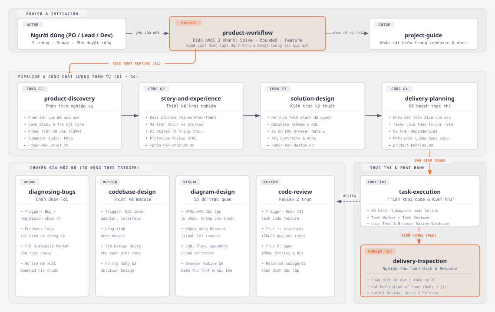
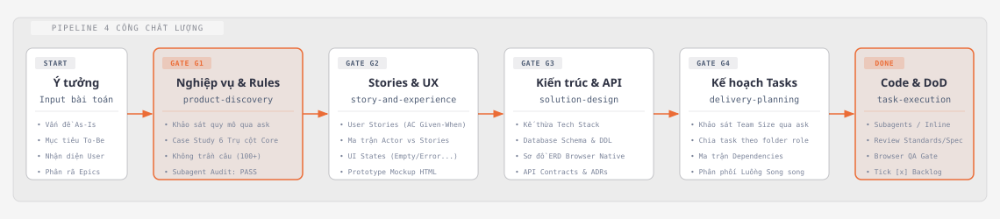

# Product Workflow Skills for AI Agents

Bộ kỹ năng (Agent Skills) hỗ trợ quy trình phát triển phần mềm từ làm rõ yêu cầu, thiết kế giải pháp đến lập trình và kiểm thử trên các AI coding harness (Oh My Pi, Claude Code, Cursor).

Thay vì để AI tự suy đoán nghiệp vụ hoặc nhảy vào viết code ngay, bộ kỹ năng này tổ chức công việc theo các vai trò rõ ràng:

- Làm rõ bài toán và quy tắc nghiệp vụ trước khi thiết kế.
- Thống nhất user stories, luồng giao diện, kiến trúc dữ liệu và hợp đồng API trước khi triển khai.
- Phân rã tính năng thành các phần việc cụ thể, có kiểm chứng và lưu lại tài liệu theo phiên bản trong `docs/workflow/`.

## Cấu trúc các kỹ năng

Hệ thống gồm một kỹ năng điều phối, một kỹ năng định hướng dự án, bảy kỹ năng chuyên môn chính và ba kỹ năng chuyên gia nội bộ được tự động điều phối theo trigger:

<p align="center">
  
</p>
<p align="center"><em>Sơ đồ kiến trúc 12 Agent Skills và các chuyên gia nội bộ theo trigger (thiết kế theo <code>diagram-design</code>).</em></p>

### Kỹ năng điều phối và định hướng

- `product-workflow`: Tiếp nhận yêu cầu của người dùng, phân tích mục đích và chỉ gọi đúng kỹ năng chuyên môn cần thiết để tiết kiệm ngữ cảnh.
- `project-guide`: Dành cho người mới tham gia dự án hoặc chưa nắm rõ hiện trạng. Kỹ năng này đọc tài liệu hiện có, tổng hợp tiến độ từng phần và đề xuất bước xử lý tiếp theo.

### Các kỹ năng theo vai trò chuyên môn

- `product-discovery` (Phân tích nghiệp vụ): Phỏng vấn nghiệp vụ chuyên sâu bằng kịch bản Case Study bám sát độ lớn nhỏ của dự án; không giới hạn trần 50 câu (có thể hỏi hơn 100 câu nếu cần), nghiêm cấm hỏi qua loa 2–3 câu rồi chốt cổng; bắt buộc qua Subagent Audit độc lập đạt PASS theo 6 trụ cột cốt lõi (core) mới được duyệt Cổng G1 sang G2.
- `story-and-experience` (Thiết kế trải nghiệm người dùng): Chuyển nghiệp vụ thành user stories kèm tiêu chí nghiệm thu (Given-When-Then), danh mục màn hình, các trạng thái giao diện và cung cấp tùy chọn tạo bản Prototype Mockup tương tác qua Browser Native trước khi duyệt Cổng G2.
- `solution-design` (Kiến trúc kỹ thuật): Đánh giá phương án công nghệ theo ràng buộc thực tế, thiết kế schema dữ liệu; khi có DB bắt buộc tạo sơ đồ ERD HTML/SVG và kiểm thử trực quan bằng Browser Native (font chữ, mũi tên liên kết), thiết lập hợp đồng API và ADR (Cổng G3).
- `delivery-planning` (Lập kế hoạch thực hiện): Khảo sát quy mô nhóm qua `ask` trước khi chia task, phân chia task theo folder chuyên môn, lập ma trận ràng buộc (dependencies) và phân phối các luồng làm song song tại Cổng G4.
- `task-execution` (Thực thi code): Nhận task có kiểm soát, viết code đúng phạm vi, kiểm chứng và cập nhật điểm nghiệm thu cùng bằng chứng vào backlog.
- `delivery-inspection` (Kiểm tra và nghiệm thu): Đối chiếu AC, review và kiểm chứng tích hợp trước khi tích hoàn thành; báo tổng điểm và điều kiện phát hành.
- `diagram-design` (Thiết kế sơ đồ trực quan thay Mermaid): Tạo sơ đồ kiến trúc, DB schema, flow, sequence dưới dạng file HTML/SVG độc lập, hiển thị sắc nét trong `docs/workflow/diagrams/`.

### Kỹ năng chuyên gia nội bộ (Tự động kích hoạt theo trigger)

Ba kỹ năng này được thiết lập `hide: true`, không làm quá tải danh sách kỹ năng ban đầu và chỉ được router hoặc các cổng kiểm soát tự động kích hoạt khi thỏa điều kiện:
- `diagnosing-bugs`: Tự động kích hoạt khi gặp bug, regression hoặc suy giảm hiệu năng chưa rõ nguyên nhân; tạo feedback loop kiểm chứng và trả về Diagnosis Packet có bằng chứng trước khi lập đề xuất Bounded.
- `codebase-design`: Tự động kích hoạt khi có thay đổi liên quan đến module, interface, seam, adapter hoặc khả năng kiểm thử; cung cấp lăng kính deep-module và trả về Design Delta cho `solution-design`.
- `code-review`: Tự động kích hoạt trước khi hoàn thành Feature hoặc Risky Bounded; thẩm định độc lập theo hai trục (Standards và Spec) song song hoặc tuần tự.

## Các cổng kiểm soát chất lượng

Quy trình áp dụng bốn cổng kiểm soát (Gates) theo từng tính năng hoặc module, không bắt dự án phải dừng lại chờ đặc tả toàn bộ mới được làm:

<p align="center">
  
</p>
<p align="center"><em>Quy trình 4 Cổng kiểm soát chất lượng tuần tự (G1 ➔ G4) từ Ý tưởng đến Hoàn thành nghiệm thu.</em></p>

- Gate G1 (Nghiệp vụ): Mục tiêu bài toán và các quy tắc nghiệp vụ cốt lõi đã được người phụ trách xác nhận.
- Gate G2 (Stories và UX): Toàn bộ tiêu chí nghiệm thu và luồng thao tác của phần tính năng tiếp theo đã thống nhất.
- Gate G3 (Kiến trúc): Công nghệ, schema dữ liệu và hợp đồng API cần cho triển khai đã được phê duyệt.
- Gate G4 (Sẵn sàng thực thi): Tính năng đã được chia thành các task cụ thể, đầy đủ điều kiện tiên quyết và không còn vướng mắc kỹ thuật.

## Product Backlog dạng ma trận

Trong dự án sử dụng skills, agent cập nhật backlog chính tại `docs/workflow/product-backlog.md`, hoặc backlog tương đương đã có. Mỗi hàng là một tính năng; roadmap chỉ liên kết các ID được chọn và kế hoạch sprint, không chép thêm bảng backlog.

Các cột gồm Rank, ID, Epic/phân hệ, tính năng, links actors/story, ưu tiên, Story Points, AC đạt/tổng, trạng thái, `[ ]` / `[x]` và tasks/bằng chứng. Mẫu chi tiết dùng chung nằm trong `product-workflow/references/records.md`.

- Story Points là ước lượng do đội duyệt; chưa ước lượng thì ghi `—`.
- AC đạt/tổng là số tiêu chí nghiệm thu đã được kiểm chứng, không phải số tests hay tasks.
- Agent điều phối cập nhật sau mỗi kết quả task, review và kiểm chứng. Chỉ tích `[x]` khi đủ AC, review bắt buộc và kiểm chứng tích hợp; khi evidence mất hiệu lực thì bỏ tích phần ảnh hưởng và tính lại điểm.
- Tổng quan tách riêng tính năng Done, SP hoàn tất và AC đạt. Không cộng SP theo phần trăm AC hoặc dùng các tỷ lệ này làm phần trăm sản phẩm hoàn thành.
- Không có Jira thì dùng backlog local. Nếu đã chọn Jira làm nguồn chính, Markdown phản ánh trạng thái Jira và bằng chứng; mất kết nối không tự đổi nguồn. Workers cập nhật task cards, người điều phối cập nhật ma trận chung.

Đây là hướng dẫn để agent tạo backlog trong dự án đích. Cài đặt hoặc chỉnh sửa bộ skills không tự tạo backlog mẫu trong repo này.

### Hồ sơ vừa đủ theo phạm vi

- Bounded/Spike: đề xuất trong chat, chờ duyệt đúng nhánh rồi thực thi và kiểm chứng; không sinh bộ tài liệu G1–G4.
- Feature: giữ G1–G4, cập nhật brief/stories/design/plan của phân hệ hiện hữu. Không tạo bộ file mới cho mỗi chỉnh sửa.
- Task nhỏ cùng người làm tuần tự: checklist có ID, AC, prerequisites và evidence ngay trong roadmap. Task lớn hoặc bàn giao độc lập: card riêng; roadmap chỉ giữ link.
- UI/DB/API/logic/kiểm chứng là checklist phạm vi, không phải năm task bắt buộc.
- Tái dùng stack, contracts và sơ đồ còn phù hợp. Chỉ tạo sơ đồ khi bảng/chữ chưa diễn đạt rõ hoặc người dùng yêu cầu; sơ đồ đã tạo/sửa vẫn phải qua Browser Native quality gate.
- Discovery phỏng vấn đào sâu qua nhiều đợt case study theo độ lớn nhỏ dự án; chỉ trình duyệt G1 khi Subagent Reviewer xác nhận PASS và không còn câu hỏi chặn. Evidence/review/handoff lưu trong record hiện hữu hoặc links output, không thêm báo cáo cho mỗi bước.

## Tối ưu hóa cho Oh My Pi (OMP)

Khi chạy trong Oh My Pi, hệ thống tự động kích hoạt các tính năng native:
- **Duyệt cổng tương tác bằng công cụ `ask`**: Thay vì phải tự gõ lệnh, terminal hiển thị menu chọn trực quan (`[Duyệt và tiếp tục]`, `[Cần điều chỉnh]`, `[Giải thích thêm]`) tại mỗi cổng G1–G4.
- **Lập kế hoạch chi tiết (Plan Mode)**: Bẻ nhỏ tính năng thành các task độc lập kèm đầy đủ file paths và tiêu chí nghiệm thu (AC) trước khi viết code.
- **Hỏi người dùng chọn mô hình Subagents**: Sau khi duyệt Cổng G4, AI dùng `ask` để bạn chọn:
  1. **Spawn Subagents (Mô hình 3 tầng)**:
     - *Task Worker*: Thực thi trong phạm vi task, ghi evidence và bàn giao để review.
     - *Task Reviewer*: Thẩm định diff theo AC và quy ước dự án.
     - *Agent điều phối và Reviewer tổng*: Kiểm chứng tích hợp/shared contracts/AC xuyên module; tái dùng review đúng scope/revision, chỉ review lại phần bị ảnh hưởng. Cập nhật backlog và checkbox khi đủ DoD.
  2. **Thực thi tuần tự (Inline Execution)**: Main Agent tự làm từng task.
  3. **Từng task có xác nhận**: Dừng lại xin duyệt diff sau mỗi task.

- **Tích hợp Engine Browser Native (Chromium)**:
  - *Quality gate tự động cho Diagram*: Mỗi lần tạo hoặc sửa sơ đồ HTML/SVG, AI tự mở file trong Chromium, chờ font ổn định, đo bounding box DOM/SVG, kiểm tra overflow, tọa độ và va chạm mũi tên, rồi chụp screenshot làm evidence. `failed` hoặc `not-run` chặn bàn giao và claim Done.
  - *Preview tùy chọn*: Sau khi quality gate đạt, AI mới dùng `ask` nếu bạn muốn mở xem sơ đồ trực quan. Với Frontend/UI không phải diagram, AI vẫn hỏi trước khi mở Browser Native.
## Cài đặt
### Cách 1: Chọn skills qua `npx skills`

Chạy lệnh sau trong terminal của bạn để mở giao diện tương tác chọn skills (giống hệt ảnh của bạn):

```bash
npx skills@latest add duchuyn04/product-workflow-skills
```

Giao diện terminal sẽ hiển thị bảng danh sách 9 skills:
- Dùng phím mũi tên `↑` `↓` để di chuyển.
- Phím `Space` để chọn hoặc bỏ chọn từng kỹ năng, hoặc chọn `Select All (0/9)`.
- Phím `Enter` để xác nhận cài đặt.

**Kích hoạt quy trình trước khi sửa source:** Cài skills không bảo đảm agent tự đọc chúng. Để dùng toàn bộ workflow ở cấp dự án, chạy thêm installer dưới đây; lệnh cài/cập nhật đầy đủ 12 skills (bao gồm 3 chuyên gia nội bộ) vào `.agents/skills/` và tích hợp một khối chỉ dẫn ngắn vào `AGENTS.md`:

```bash
npx github:duchuyn04/product-workflow-skills --project
```

Installer giữ nội dung ngoài marker `BEGIN/END: product-workflow-skills`; cài lại chỉ thay khối của bộ skills. Không đặt rules riêng bên trong khối này. Marker hỏng/trùng khiến bước tích hợp báo lỗi và giữ nguyên `AGENTS.md`.

Mở phiên agent mới sau cài đặt để nạp rules. Với OMP, có thể gọi `/skill:product-workflow` rõ ràng. Xác nhận harness đã nạp `AGENTS.md`; các harness dùng file rules khác cần tích hợp khối tương ứng vào file được hỗ trợ.

Bounded vẫn phải trình phương án và chờ duyệt; tính năng mới trên repo có sẵn vẫn đi G1–G4. Rules là chỉ dẫn cho LLM, không phải khóa công cụ. Cài global chỉ cài skills, không kích hoạt rules cho từng dự án.

**Các tùy chọn cài đặt nhanh:**
```bash
# Cài đặt tự động toàn bộ 9 skills không cần chọn thủ công
npx skills@latest add duchuyn04/product-workflow-skills -y --all

# Cài đặt toàn cục (Global) cho tài khoản máy tính
npx skills@latest add duchuyn04/product-workflow-skills -g

# Cập nhật các skills đã cài lên phiên bản mới nhất
npx skills update
```

---

### Cách 2: Trình cài đặt kèm đồng bộ tự động `AGENTS.md`

Nếu bạn muốn cài đặt và tự động tạo hoặc tích hợp khối chỉ dẫn vào file `AGENTS.md` ở thư mục gốc dự án:

```bash
npx github:duchuyn04/product-workflow-skills
```

Installer hiển thị menu lựa chọn:
```text
1. Project: .agents/skills/ và AGENTS.md trong dự án hiện tại
2. Global: ~/.omp/agent/skills/ cho Oh My Pi
```
Nhập `1` (hoặc Enter) để cài cho Project; nhập `2` để cài Global.

Có thể chọn trực tiếp bằng cờ:
```bash
# Cài vào dự án hiện tại
npx github:duchuyn04/product-workflow-skills --project

# Cài vào một dự án khác
npx github:duchuyn04/product-workflow-skills --project ./my-project

# Cài global cho Oh My Pi
npx github:duchuyn04/product-workflow-skills --global
```
### Đóng gói và chạy bản local

Từ thư mục mã nguồn:

```bash
npm pack
```

Lệnh tạo `product-workflow-skills-<version>.tgz`. Dùng đường dẫn đến gói để chạy bản local mà không cần publish npm:

```bash
npx --yes --package ./product-workflow-skills-1.0.0.tgz product-workflow-skills
```

Có thể thêm `--project ./my-project` hoặc `--global` sau tên lệnh `product-workflow-skills`. Trong terminal tương tác, bỏ cờ để dùng menu.

Sau khi chủ sở hữu publish package lên npm, có thể gọi `npx product-workflow-skills`. `npm pack` chỉ tạo gói local, không publish hoặc cập nhật GitHub.

### Sao chép thủ công

Sao chép các thư mục kỹ năng vào `.agents/skills/` trong dự án và tích hợp chỉ dẫn từ `AGENTS.md`. Với Oh My Pi global, sao chép skills vào `~/.omp/agent/skills/`.

## Câu lệnh mẫu theo nhu cầu


| Nhu cầu                        | Câu lệnh mẫu                                                             |
| ------------------------------ | ------------------------------------------------------------------------ |
| Định hướng dự án               | "Tôi mới vào dự án, hiện tại dự án đang ở đâu và tôi nên làm gì tiếp?"   |
| Phân tích nghiệp vụ            | "Làm rõ nghiệp vụ xử lý trùng lặp dữ liệu và các quy tắc liên quan."     |
| Viết User Stories              | "Viết User Stories và đặc tả trạng thái giao diện cho màn hình tạo mới." |
| Thiết kế kiến trúc và API      | "Thiết kế database schema và REST API contracts cho module này."         |
| Lập kế hoạch sprint            | "Chia nhỏ tính năng thành các task cụ thể để chuẩn bị triển khai."       |
| Triển khai code                | "Thực hiện task API đăng nhập và chạy unit test."                        |
| Kiểm tra tiến độ và nghiệm thu | "Xem ma trận tiến độ và kiểm tra tiêu chí hoàn thành của sprint này."    |


