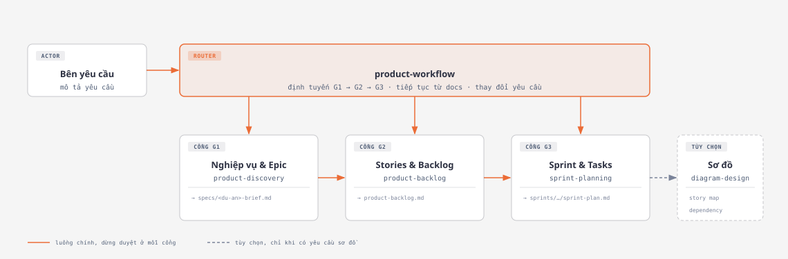
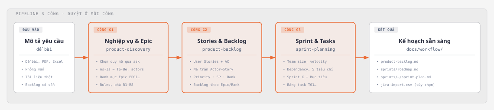

# Product Workflow Skills for AI Agents

Bộ kỹ năng (Agent Skills) cho các AI coding agent như Oh My Pi và Claude Code, chuyển **mô tả yêu cầu** thành **Product Backlog** và **kế hoạch sprint có chia task**:

```text
Mô tả yêu cầu → Epic → User Story → Ma trận Actor–Story → Product Backlog (Rank / Priority / Story Point)
             → Sprint Planning → Sprint → Task / Sub-task → (CSV import Jira)
```

Phạm vi của bộ skills là lập kế hoạch sản phẩm: không bao gồm viết code, thiết kế kiến trúc, review hay nghiệm thu. Toàn bộ kết quả được lưu dưới dạng Markdown trong `docs/workflow/` của dự án.

## Cấu trúc các kỹ năng

<p align="center">
  
</p>

| Kỹ năng | Vai trò |
|---|---|
| `product-workflow` | Điểm vào duy nhất. Xác định cổng hiện tại, định tuyến tới kỹ năng tương ứng, tiếp tục từ tài liệu có sẵn và xử lý thay đổi yêu cầu. |
| `product-discovery` | Cổng G1. Phân tích mô tả, phỏng vấn tình huống theo quy mô dự án, chuyển As-Is sang To-Be, xác định actors, quy tắc nghiệp vụ và danh mục Epic. |
| `product-backlog` | Cổng G2. Tách yêu cầu thành User Stories có tiêu chí nghiệm thu, lập ma trận Actor–Story, đề xuất Priority, Story Point, Rank và xuất Product Backlog. |
| `sprint-planning` | Cổng G3. Khảo sát quy mô nhóm, độ dài sprint và velocity; phân tích dependency; xếp story vào từng sprint; xác định Sprint Goal; chia task; xuất CSV cho Jira. |
| `diagram-design` | Tùy chọn. Vẽ story map, chuỗi dependency hoặc roadmap dạng HTML/SVG khi có yêu cầu. |

Ba kỹ năng cổng được ẩn (`hide: true`; trên Claude Code là `disable-model-invocation: true`): model không tự gọi, `product-workflow` đọc chúng khi đến cổng tương ứng.

## Ba cổng duyệt

<p align="center">
  
</p>

| Cổng | Kết quả | File |
|---|---|---|
| G1 Nghiệp vụ & Epic | Vấn đề As-Is/To-Be, actors, danh mục Epic `EP01…`, quy tắc nghiệp vụ, bảng phủ yêu cầu R1–R8 | `docs/workflow/specs/<du-an>-brief.md` |
| G2 Stories & Backlog | User Stories `US01…` với tiêu chí Given/When/Then, ma trận Actor–Story, Product Backlog theo Epic và theo Rank | `docs/workflow/specs/<du-an>-stories.md`, `docs/workflow/product-backlog.md` |
| G3 Sprint & Tasks | Lộ trình các sprint, mỗi sprint có Goal, danh sách story trong capacity và bảng task `T01…` | `docs/workflow/sprints/roadmap.md`, `docs/workflow/sprints/sprint-<X>-<slug>/sprint-plan.md`, tùy chọn `docs/workflow/jira-import.csv` |

Tại mỗi cổng, agent lưu tài liệu, tóm tắt kết quả trong chat và dừng để chờ phê duyệt. Priority, Story Point, Rank và phân bổ sprint do AI đưa ra giữ trạng thái đề xuất cho đến khi được phê duyệt.

Quy ước đặt tên:
- Epic: `Quản lý + …`, ví dụ `EP02 – Quản lý bán hàng`.
- Sprint: `Sprint X – <Mục tiêu>`, ví dụ `Sprint 1 – Bán hàng cơ bản`, lưu trong `docs/workflow/sprints/sprint-1-ban-hang-co-ban/`.

## Ví dụ kết quả

Với đề bài "Quản lý bán hàng điện thoại", Product Backlog theo Rank có dạng:

| Rank | ID | Epic | User Story | Priority | Story Point | Sprint |
|---|---|---|---|---|---|---|
| 1 | US20 | Tài khoản | Đăng nhập | Highest | 3 | Sprint 1 |
| 2 | US05 | Bán hàng | Tạo đơn hàng | Highest | 5 | Sprint 1 |
| 3 | US06 | Bán hàng | Thêm sản phẩm vào đơn | Highest | 5 | Sprint 2 |

Và lộ trình sprint:

| Sprint | Sprint Goal | SP |
|---|---|---|
| Sprint 1 – Bán hàng cơ bản | Nhân viên đăng nhập, tìm điện thoại, kiểm tra tồn kho và tạo đơn | 20 |
| Sprint 2 – Hoàn thiện thanh toán | Thêm sản phẩm vào đơn, tính tiền, thanh toán và trừ kho | 18 |
| Sprint 3 – Khách hàng và báo cáo | Khách hàng, hóa đơn, báo cáo doanh thu | 19 |

Mỗi sprint có bảng task cho từng story, ví dụ `US20 – Đăng nhập`: T01 màn hình Login, T02 API Login, T03 kiểm tra username/password, T04 testing.

## Cài đặt

### Cách 1: Cài đặt nhanh qua `npx skills`

Lệnh sau mở giao diện chọn skills trong terminal:

```bash
npx skills@latest add duchuyn04/product-workflow-skills
```

Chọn các kỹ năng cần cài (hoặc toàn bộ) và xác nhận bằng Enter.

Để áp dụng đầy đủ quy tắc ở cấp dự án, cần chạy thêm lệnh tích hợp vào `AGENTS.md`:

```bash
npx github:duchuyn04/product-workflow-skills --project
```

Lệnh trên cài đặt đầy đủ 5 kỹ năng vào thư mục `.agents/skills/` và bổ sung khối chỉ dẫn tương ứng vào `AGENTS.md`.

Các tùy chọn cài đặt dòng lệnh:

```bash
# Cài đặt tự động toàn bộ skills
npx skills@latest add duchuyn04/product-workflow-skills -y --all

# Cài đặt toàn cục cho tài khoản máy tính
npx skills@latest add duchuyn04/product-workflow-skills -g

# Cập nhật các skills đã cài lên bản mới nhất
npx skills update
```

---

### Cách 2: Trình cài đặt kèm đồng bộ cấu hình

Chạy trực tiếp trình cài đặt:

```bash
npx github:duchuyn04/product-workflow-skills
```

Trình cài đặt yêu cầu chọn lần lượt:
1. Harness: `Oh My Pi`, `Claude Code` hoặc cả hai.
2. Phạm vi: `Project` (cài vào dự án hiện tại và đồng bộ file chỉ dẫn) hoặc `Global` (cài vào thư mục toàn cục của tài khoản hệ điều hành).

| Harness | Project | Global | File chỉ dẫn (Project) |
|---|---|---|---|
| Oh My Pi (`--omp`, mặc định) | `.agents/skills/` | `~/.omp/agent/skills/` | `AGENTS.md` |
| Claude Code (`--claude`) | `.claude/skills/` | `~/.claude/skills/` | `AGENTS.md` và khối `@AGENTS.md` trong `CLAUDE.md` |

Chỉ định trực tiếp qua tham số dòng lệnh (không chọn harness thì mặc định Oh My Pi):

```bash
# Cài vào dự án hiện tại
npx github:duchuyn04/product-workflow-skills --project

# Cài vào một dự án cụ thể
npx github:duchuyn04/product-workflow-skills --project ./my-project

# Cài toàn cục cho Oh My Pi
npx github:duchuyn04/product-workflow-skills --global

# Cài cho Claude Code trong dự án hiện tại
npx github:duchuyn04/product-workflow-skills --claude --project

# Cài toàn cục cho Claude Code
npx github:duchuyn04/product-workflow-skills --claude --global

# Cài cho cả Oh My Pi và Claude Code
npx github:duchuyn04/product-workflow-skills --all --project
```

### Nâng cấp từ bản 1.x

Bản 2.0 gỡ các kỹ năng liên quan tới code (`solution-design`, `task-execution`, `delivery-inspection`, `code-review`, `codebase-design`, `diagnosing-bugs`), gỡ `project-guide`, và đổi tên `story-and-experience` → `product-backlog`, `delivery-planning` → `sprint-planning`. Trình cài đặt không tự xóa thư mục cũ trong thư mục skills, vì thư mục trùng tên có thể là skill riêng của dự án; thay vào đó, trình cài đặt in cảnh báo để xóa thủ công.

### Dùng với Claude Code

- Skills được cài vào `.claude/skills/`. Gọi `/product-workflow` để bắt đầu; cần mở phiên Claude Code mới sau khi cài.
- Claude Code bỏ qua `AGENTS.md` khi dự án đã có `CLAUDE.md`, nên installer thêm khối có marker chứa `@AGENTS.md` vào `CLAUDE.md` (tạo file nếu chưa có, giữ nguyên nội dung sẵn có, bỏ qua nếu `CLAUDE.md` đã import `AGENTS.md`).
- Skills viết theo tên công cụ Oh My Pi; bảng ánh xạ `product-workflow/references/harness.md` quy đổi sang công cụ của Claude Code: `ask` thành `AskUserQuestion`, `task`/subagent thành `Agent`, `skill://` thành đọc file trong `.claude/skills/`.
- Chỉ `diagram-design` cần browser để kiểm tra sơ đồ. Trên Claude Code, dùng MCP browser như Playwright MCP hoặc Chrome DevTools MCP; nếu chưa cấu hình, sơ đồ được ghi `not-run`.

### Đóng gói và chạy bản cục bộ

Tạo gói cài đặt từ thư mục mã nguồn:

```bash
npm pack
```

Chạy gói vừa tạo, không cần tải từ registry:

```bash
npx --yes --package ./product-workflow-skills-2.0.0.tgz product-workflow-skills
```

### Sao chép thủ công

Sao chép các thư mục kỹ năng vào `.agents/skills/` (Oh My Pi) hoặc `.claude/skills/` (Claude Code) trong dự án và bổ sung chỉ dẫn từ `AGENTS.md`; với Claude Code, thêm dòng `@AGENTS.md` vào `CLAUDE.md` nếu dự án đã có file này. Đối với cấu hình toàn cục, sao chép vào `~/.omp/agent/skills/` (Oh My Pi) hoặc `~/.claude/skills/` (Claude Code).

## Câu lệnh mẫu

| Mục đích | Câu lệnh mẫu |
|---|---|
| Bắt đầu từ mô tả | "Phân tích yêu cầu sau và lập product backlog: <dán mô tả hệ thống>" |
| Có sẵn đề bài dạng file | "Đọc file de-bai.pdf, xác định Epic và actors." |
| Viết stories | "Tách các Epic đã duyệt thành user stories và ma trận actor." |
| Chia sprint | "Nhóm 4 người, sprint 2 tuần, chia sprint và task cho backlog này." |
| Xuất Jira | "Xuất backlog và sprint ra file CSV để import Jira." |
| Thay đổi yêu cầu | "Thêm chức năng đổi trả hàng vào backlog và lập lại các sprint chưa bắt đầu." |
| Tiếp tục | "Tiếp tục từ chỗ đang làm." |
